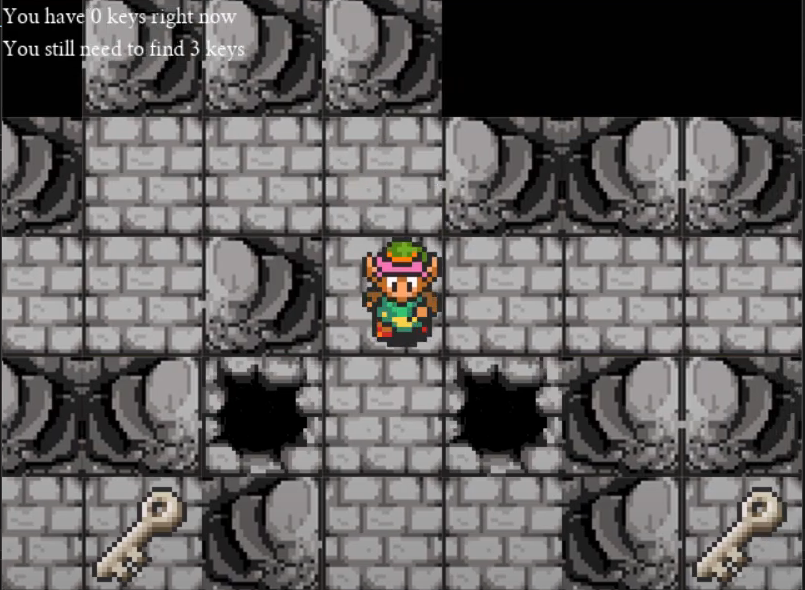
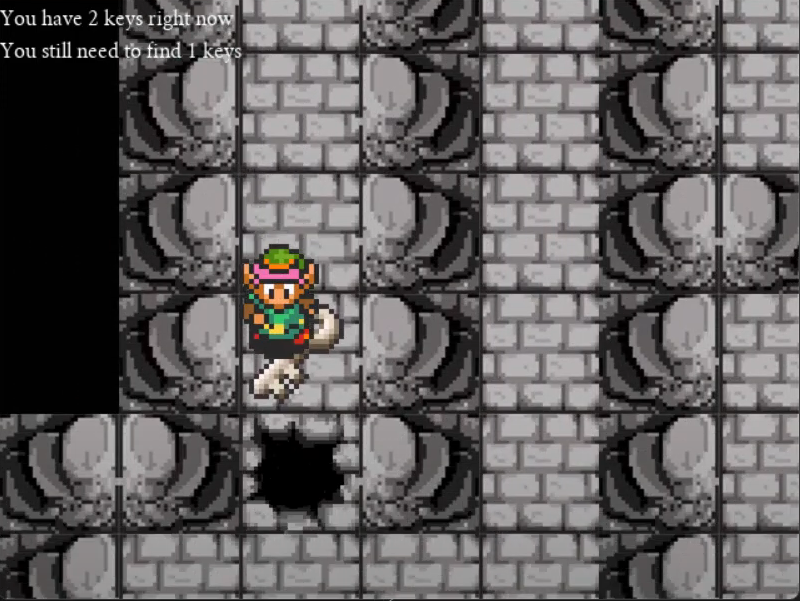

# Dungeon Adventure

A small SDL2 Game written in C++ and based on an idea from The Legend of Zelda: A Link to the Past, but is a much more simplified edition.

This is what it looks like: click [here](https://www.youtube.com/watch?v=SBL8ckMv_b4&ab_channel=Tu%E1%BA%A5nAnhNguy%E1%BB%85nNg%E1%BB%8Dc).

The libraries are C++ libraries, SDL2, SDL2_image, SDL2_font,SDL2_mixer.

You can download these libraries [here](https://github.com/libsdl-org/SDL/releases/tag/release-2.30.2).

# Prerequisites

-   You need to download SDL2 libraries as I mentioned above and install them in Visual Studio. [Here](https://visualstudio.microsoft.com/fr/downloads/) is the link to download Visual Studio.
-   This is a link leading to a youtube video about how to install SDL2 in Visual Studio. Click [here](https://www.youtube.com/watch?v=UgJadfInqyo&ab_channel=Th%C3%A0nhAnOfficial).

After completing the above steps, continue as following:

-   Clone the forked repo to your local via the command: *git clone https://github.com/SImplordseele/Dungeon_Adventure.git*
-   The folder will be downloaded to the computer, usually in drive C (default). Open the Visual Studio file named Dungeon_Adventure.sln to open Visual Studio, then press F5 to play.

# Controls

Click on Help on the menu screen to see details.

-   WASD to move the player
-   SPACE to pick up the key
-   SPACE to open door

Note:

-   You need to have a total of 3 keys to open the door, otherwise you can enter the next level.
-   You also need to avoid traps (holes) or you’ll fall and die.

# Reference and Assets

The reference source is
